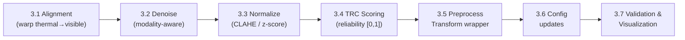

# Phase 3 — Preprocessing & Reliability (TRC)

> Status: ✅ **Implemented & verified end-to-end on LLVIP** (2026-07-07)
> Prereq: ✅ Phase 2 complete — see [`PHASE2_IMPLEMENTATION.md`](PHASE2_IMPLEMENTATION.md).
> This is Layer 2 of the 7-layer TriNetra architecture. It sits **between the
> DataLoader (Phase 2) and the fusion module (Phase 4)**.
>
> **Resolved open questions** (see recommendations at the bottom of this file):
> (1) online preprocessing, (2) scalar TRC first (`spatial_map: false`),
> (3) unsupervised TRC. `preprocessing.trc.spatial_map` and the per-region
> `trc_map` are wired but off by default, ready for a Phase 4 iteration.
>
> **As-built notes:**
> - All modules run through `env/Scripts/python.exe` (has cv2 5.0, skimage, torch).
> - The `gradient` cue constant was **calibrated to LLVIP** thermal (median
>   Laplacian variance ≈ 33 — IR is naturally smooth), so clean night frames
>   score ~0.62–0.79 (val mean **0.758**) while blur/saturation/flat all lower TRC.
> - `PreprocessPipeline` output stays **uint8**, preserving the Phase 2 ordering
>   contract (Albumentations spatial + ImageNet `Normalize` still runs after).
> - `DualModalDataset` now accepts a `preprocess=` callable and emits `trc`
>   (float in target dict) — verified on a real val batch.

Phase 3 takes the aligned visible+thermal pairs from the Phase 2 pipeline and
makes them *fusion-ready*: spatially registered, denoised, intensity-normalized,
and — the novel piece — annotated with a **Thermal Reliability Confidence (TRC)**
score that tells later stages *how much to trust the thermal modality* per frame
(and optionally per region).

> [!IMPORTANT]
> **Why TRC matters for the model.** The TRC score computed here is the signal
> that drives **adaptive** fusion in Phase 4. When thermal is degraded (sensor
> saturation, thermal crossover at dawn/dusk, blur), TRC → low, and fusion
> down-weights thermal features. This is the "Adaptive" in TriNetra-AMRF.

---

## Overview of Sub-Tasks



| # | Sub-Task | File(s) | Blocking? |
|---|----------|---------|-----------|
| 3.1 | Spatial alignment | `preprocessing/alignment.py` | Yes (already aligned for LLVIP → light) |
| 3.2 | Modality-aware denoising | `preprocessing/denoise.py` | Yes |
| 3.3 | Intensity normalization | `preprocessing/normalize.py` | Yes |
| 3.4 | **Thermal Reliability Confidence** | `preprocessing/trc.py` **[NEW]** | Yes — feeds Phase 4 fusion |
| 3.5 | Unified preprocess transform | `preprocessing/pipeline.py` **[NEW]** | Yes — wires 3.1–3.4 into the DataLoader |
| 3.6 | Config updates | `configs/default.yaml` | Yes |
| 3.7 | Validation & visualization | `utils/visualize_preproc.py` **[NEW]** | Recommended |

---

## 3.1 — Spatial Alignment (`preprocessing/alignment.py`)

LLVIP is already pixel-aligned (Phase 2 wrote an identity `homography.npy`), so
for LLVIP this is a **pass-through**. The module still implements real warping so
other sensors (FLIR ADAS, custom rigs) work later.

```python
def align_thermal_to_visible(visible, thermal, homography=None):
    """
    Warp thermal into the visible reference frame.
      - If homography is None or identity → return thermal unchanged (LLVIP).
      - Else cv2.warpPerspective(thermal, H, (W, H_img)).
    Returns (aligned_thermal, reproj_error_or_None).
    """

def estimate_homography(visible, thermal, method="orb"):
    """Feature-based (ORB/SIFT + RANSAC) homography estimation for un-calibrated
    sensor pairs. Returns 3×3 H and inlier ratio."""
```

- Reads `preprocessing.alignment.method` and `calibration_dir/homography.npy`.
- Records **reprojection error** as an alignment-quality metric (feeds TRC 3.4).

---

## 3.2 — Modality-Aware Denoising (`preprocessing/denoise.py`)

Different noise profiles per modality:

| Modality | Dominant noise | Recommended filter |
|----------|----------------|--------------------|
| Visible (low-light) | shot/read noise, ISO grain | Non-local means / bilateral |
| Thermal (IR) | fixed-pattern noise, NUC residual, blur | Bilateral (edge-preserving) or guided |

```python
def denoise(image, modality: str, cfg: dict):
    """Dispatch on cfg['preprocessing']['denoise']['method']:
       bilateral | nlm | gaussian | guided (visible guides thermal)."""
```

> [!TIP]
> Keep denoising **mild** — over-smoothing erases the small-pedestrian edges LLVIP
> depends on. Expose strength in config; default to bilateral d=5.

---

## 3.3 — Intensity Normalization (`preprocessing/normalize.py`)

Harmonize the very different dynamic ranges (8-bit RGB vs. thermal).

```python
def normalize(image, modality: str, cfg: dict):
    """Methods: clahe | minmax | zscore | percentile_clip.
       Thermal: percentile-clip (1–99%) before rescale to suppress hot outliers.
       Visible (low-light): CLAHE on the L channel to lift shadow detail."""
```

> [!IMPORTANT]
> **Ordering vs. Phase 2 normalization.** Phase 2's `Albumentations.Normalize`
> (ImageNet mean/std) is the *final* tensor-normalization for the network.
> Phase 3 normalization (CLAHE/clip) is a *pre-conditioning* step on the **uint8
> image** that happens **before** augmentation. Decision required — see Open
> Questions #1 (integrate into the Dataset, or run as an offline cache pass).

---

## 3.4 — Thermal Reliability Confidence (`preprocessing/trc.py`) **[NEW — novel]**

The centerpiece of Layer 2. Produces a scalar (and optional spatial map)
`trc ∈ [0, 1]` estimating thermal trustworthiness for the frame.

```python
def compute_trc(thermal, visible=None, align_error=None, cfg=None) -> dict:
    """
    Combine cheap, unsupervised reliability cues into one score:

      - contrast/entropy   : flat or saturated thermal → low reliability
      - gradient energy     : blur / defocus detection (Laplacian variance)
      - saturation ratio    : fraction of pixels at 0 or 255 (sensor clipping)
      - thermal-crossover    : low RGB↔IR mutual information → crossover risk
      - alignment error      : high reprojection error → low reliability

    Returns {"trc": float, "trc_map": np.ndarray[H,W] | None, "components": {...}}.
    """
```

Design notes:
- **Unsupervised & fast** (no training, runs in the data pipeline).
- Each component normalized to `[0,1]`; final `trc` = weighted mean (weights in
  config) — optionally a small learned MLP later.
- `trc_map` (per-region) enables **spatially-adaptive** fusion in Phase 4.

> [!IMPORTANT]
> **This is the hand-off to Phase 4.** The DataLoader target dict gains a
> `trc` field; the fusion module multiplies the thermal feature branch by
> (a broadcast of) `trc`. See the architecture note at the end of this file.

---

## 3.5 — Unified Preprocess Transform (`preprocessing/pipeline.py`) **[NEW]**

A single callable that runs 3.1 → 3.2 → 3.3 → 3.4 and plugs into the Phase 2
`DualModalDataset` (which already accepts a `transform`).

```python
class PreprocessPipeline:
    """align → denoise → normalize → TRC, on uint8 arrays, BEFORE augmentation.
       Returns (visible, thermal, extras={'trc': float, 'trc_map': ...})."""
```

Integration options (see Open Questions #1):
- **(a) Online** — call inside `DualModalDataset.__getitem__` before augmentation.
- **(b) Offline cache** — a `preprocessing/run_preprocess.py` that writes
  processed images + a `trc.json` once; the Dataset just reads them (faster
  training, more disk).

---

## 3.6 — Config Updates (`configs/default.yaml`)

```diff
 preprocessing:
   alignment:
     method: "homography"
     reference_modality: "visible"
+    identity_ok: true              # LLVIP pre-aligned → skip warp
   denoise:
     method: "bilateral"
     strength: 10
+    apply_to: ["visible", "thermal"]
   normalize:
     method: "clahe"
     clip_limit: 2.0
     tile_grid_size: [8, 8]
+    thermal_percentile_clip: [1, 99]
+  trc:
+    enabled: true
+    components:
+      contrast:      0.2
+      gradient:      0.2
+      saturation:    0.2
+      mutual_info:   0.2
+      align_error:   0.2
+    spatial_map: false             # true → per-region trc_map for Phase 4
+    mode: "online"                 # online | offline_cache
```

---

## 3.7 — Validation & Visualization (`utils/visualize_preproc.py`) **[NEW]**

```python
def visualize_preprocessing(sample):
    """5-panel: raw thermal | denoised | normalized | trc_map | overlay.
       Confirms filters preserve edges and TRC responds to degradation."""

def trc_sanity_report(dataloader, n=200):
    """Histogram of TRC over a subset; flag frames with trc<0.3 for review."""
```

Synthetic stress test: inject blur / saturation into thermal and confirm TRC drops.

---

## Proposed Changes — File Summary

| Status | File | Purpose |
|--------|------|---------|
| [IMPL] | `preprocessing/alignment.py` | Homography warp + estimation (pass-through for LLVIP) |
| [IMPL] | `preprocessing/denoise.py` | Modality-aware denoising |
| [IMPL] | `preprocessing/normalize.py` | CLAHE / clip / z-score |
| [NEW] | `preprocessing/trc.py` | Thermal Reliability Confidence scoring |
| [NEW] | `preprocessing/pipeline.py` | Unified preprocess transform |
| [NEW] | `preprocessing/run_preprocess.py` | (if offline mode) batch cache writer |
| [NEW] | `utils/visualize_preproc.py` | Preprocessing + TRC visualization |
| [MODIFY] | `configs/default.yaml` | `preprocessing.trc` + denoise/normalize params |
| [MODIFY] | `datasets/dual_modal_dataset.py` | Optionally accept a `PreprocessPipeline` + emit `trc` in targets |

---

## Verification Plan

```bash
# 1. TRC responds to degradation (unit-style)
python -c "from preprocessing.trc import compute_trc; ..."   # blur → trc↓

# 2. Preprocessing pipeline runs on a batch and adds 'trc'
python -c "from preprocessing.pipeline import PreprocessPipeline; ..."

# 3. Visual check
python utils/visualize_preproc.py --split val --num-samples 6

# 4. TRC distribution over val
python -c "from utils.visualize_preproc import trc_sanity_report; ..."
```

**Manual:** confirm denoise preserves small-pedestrian edges; confirm TRC is
high on clean night frames and low on saturated/blurred ones.

---

## Open Questions

> [!IMPORTANT]
> **1. Online vs. offline preprocessing?**
> Online (in `__getitem__`) = simplest, always fresh, but repeats work every
> epoch. Offline cache = faster training, +~4 GB disk. Recommendation: **online
> for now** (LLVIP alignment is a no-op and filters are cheap), switch to cache
> if CPU-bound during Phase 5 training.

> [!IMPORTANT]
> **2. Is a per-region `trc_map` needed, or is a scalar per frame enough?**
> Scalar is simpler and covers frame-level degradation. A spatial map enables
> region-adaptive fusion but adds complexity. Recommendation: **scalar first**,
> add the map in a Phase 4 iteration if needed.

> [!IMPORTANT]
> **3. Unsupervised TRC vs. a small learned reliability head?**
> Start unsupervised (no labels, deterministic). A learned TRC can come later,
> trained against detection-loss improvement as a proxy signal.

---

## Architecture Note — where fusion plugs in (answers the YOLO question)

Phase 3's output (`visible`, `aligned/denoised/normalized thermal`, `trc`) feeds
**Phase 4 fusion**, which feeds a **pretrained YOLO** we do *not* train from
scratch. YOLOv8 has three parts; we keep the neck + head and split the backbone
into two streams, injecting fusion at the three backbone output scales:

```
                    ┌─────────── Visible backbone (pretrained YOLOv8) ──────────┐
 visible [3,H,W] ──▶│  P3 (layer 4)     P4 (layer 6)     P5/SPPF (layer 9)      │─┐
                    └────────────────────────────────────────────────────────┘ │
                                                                                 ├─▶ FUSION (× TRC)  ─▶  YOLO Neck (10–21) ─▶ Detect head (22)
                    ┌─────────── Thermal backbone (1-ch stem) ─────────────────┐ │
 thermal [1,H,W] ─▶│  P3'              P4'              P5'                     │─┘
   × TRC weight     └────────────────────────────────────────────────────────┘
```

- **"YOLO's three parts"** = **Backbone** (feature extraction, layers 0–9) →
  **Neck** (PAN-FPN multi-scale aggregation, layers 10–21) → **Head** (`Detect`,
  layer 22). *(Verified on ultralytics 8.4.89 / yolov8m — 23 modules.)*
- **"After the first part we add fusion"** = ✅ correct. We fuse **after the
  backbone**, at the P3/P4/P5 feature maps (strides 8/16/32), then pass the fused
  features into the *original* neck + head. This is "mid/halfway fusion", the
  standard for RGB-T detection (LLVIP/KAIST literature).
- Weights: we **load pretrained COCO YOLOv8 weights** for the visible backbone +
  neck + head, add a second (thermal) backbone, and only the fusion modules +
  thermal stem are trained from scratch → fast convergence, no from-scratch YOLO.
- **TRC** (Phase 3) scales the thermal branch inside fusion: `fused = f(P_vis,
  trc · P_thr)` — adaptive, so bad thermal can't corrupt detection.

Full detail lands in **`PHASE4_IMPLEMENTATION.md`** (fusion) and Phase 5
(detection integration & training).
```
