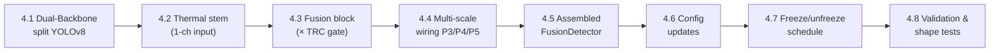

# Phase 4 — Adaptive Cross-Modal Fusion (TRC-Gated)

> Status: 🔲 **Planned** (not yet implemented)
> Prereq: ✅ Phase 2 (data) + ✅ Phase 3 (preprocessing & TRC) — see
> [`PHASE2_IMPLEMENTATION.md`](PHASE2_IMPLEMENTATION.md) and
> [`PHASE3_IMPLEMENTATION.md`](PHASE3_IMPLEMENTATION.md).
> This is **Layer 3** of the 7-layer TriNetra architecture. It sits **between
> the preprocessed dual-modal input (Phase 3) and the detection head (Phase 5)**.

Phase 4 takes the cleaned, TRC-annotated visible + thermal pairs from Phase 3
and **fuses them into a single set of feature maps** that a YOLO detector can
consume. The novel piece: fusion is **adaptive** — the Thermal Reliability
Confidence (TRC) score from Phase 3 **gates the thermal branch**, so when
thermal is unreliable the network automatically leans on the visible branch.

> [!IMPORTANT]
> **The headline decision — training vs. frozen weights.**
> Phase 4 **requires a training run**, but **not** a from-scratch one. We load
> **COCO-pretrained YOLOv8 weights**, **freeze** the visible backbone + neck +
> head, and **train only the new parts**: the thermal stem and the fusion
> modules (incl. the TRC gate). Pure "zero-training frozen" use is impossible
> because the thermal stem and fusion blocks are randomly initialized. See
> **§2 Training Strategy** — this is the most important section of the file.

---

## 1. Overview of Sub-Tasks



| # | Sub-Task | File(s) | Blocking? |
|---|----------|---------|-----------|
| 4.1 | Split YOLOv8 into two backbone streams | `models/fusion/backbone.py` **[NEW]** | Yes |
| 4.2 | Thermal stem (1-ch → backbone) | `models/fusion/thermal_stem.py` **[NEW]** | Yes |
| 4.3 | **TRC-gated fusion block** | `models/fusion/fusion_block.py` **[NEW]** | Yes — the novelty |
| 4.4 | Multi-scale wiring (P3/P4/P5) | `models/fusion/fusion_neck.py` **[NEW]** | Yes |
| 4.5 | Assembled dual-modal detector | `models/detector/fusion_detector.py` **[NEW]** | Yes — feeds Phase 5 |
| 4.6 | Config updates | `configs/default.yaml` | Yes |
| 4.7 | Freeze/unfreeze schedule (transfer learning) | `models/fusion/freeze.py` **[NEW]** | Yes |
| 4.8 | Validation, shape & gradient tests | `utils/check_fusion.py` **[NEW]** | Recommended |

---

## 2. Training Strategy — Frozen vs. Trained (READ FIRST)

This section answers the central engineering question: **what do we train, and
what do we reuse frozen?**

### 2.1 The core idea — transfer learning, not from-scratch

YOLOv8 is already an excellent detector, pretrained on COCO (80 classes,
millions of images). We do **not** throw that away. Instead:

- **Reuse (freeze) the pretrained knowledge:** visible backbone, neck, head.
- **Add and train only the new machinery:** thermal stem + thermal backbone +
  fusion blocks (with the TRC gate).

This is the standard, efficient path for RGB-T detection and it means we train a
**small fraction** of the total parameters → fast convergence, less data needed,
lower overfitting risk, runs on modest GPUs.

### 2.2 Why we CANNOT skip training entirely

Two modules are **new and randomly initialized**, so they carry no useful
weights until trained:

| New module | Why it can't be frozen from the start |
|------------|---------------------------------------|
| **Thermal stem** | Thermal is 1-channel; YOLO's pretrained stem expects 3-channel RGB. A new input layer must be learned. |
| **Fusion blocks (+ TRC gate)** | Brand-new layers that combine the two streams. Random weights → garbage features → the frozen head can't detect anything. |

> **Analogy for viva:** the pretrained YOLO is a skilled worker; the fusion
> module is a brand-new translator between two languages. The worker is ready,
> but the translator must be trained first or the worker receives nonsense.

### 2.3 The staged schedule (recommended)

```
STAGE 1 — "Warm-up the fusion" (freeze pretrained, train new)
  Frozen : visible backbone, neck, head   (COCO weights)
  Trained: thermal stem, thermal backbone, fusion blocks (+ TRC gate)
  Goal   : let the new modules learn to produce features the frozen head likes.
  LR     : normal (e.g. 1e-3), few epochs.

STAGE 2 — "Fine-tune end-to-end" (optional, unfreeze with low LR)
  Trainable: everything (or just neck + head + fusion)
  Goal     : let the detector adapt to the fused feature distribution.
  LR       : low (e.g. 1e-4 / 1e-5), with warmup.
  Benefit  : usually a further mAP gain; risk: overfitting if data is small.
```

### 2.4 The trade-off table (what to say if asked "why not just X?")

| Approach | Frozen | Trained | Pros | Cons |
|----------|--------|---------|------|------|
| **A. Everything frozen** | all | (nothing) | — | ❌ Impossible — new modules are random |
| **B. Freeze pretrained, train new** ✅ | vis backbone, neck, head | thermal stem, fusion | Fast, low data, stable | Head not adapted to fused features (cap on mAP) |
| **C. Freeze backbones only** | both backbones | neck, head, fusion | Head adapts | More compute; needs more data |
| **D. Full fine-tune** | (nothing) | all | Highest ceiling | Slow, data-hungry, can overfit / forget COCO |

**Recommendation:** **B → then optionally C/D** as Stage 2. Start with B to get a
working, adaptive detector cheaply; escalate only if mAP needs it.

### 2.5 One-line answer for the viva

> *"We use COCO-pretrained YOLO and freeze the visible backbone, neck, and head.
> We only train the new thermal stem and the TRC-gated fusion blocks. It's not
> from-scratch and not zero-training — it's transfer learning where the
> pretrained detector stays frozen and only the new fusion machinery is learned,
> with an optional low-LR fine-tune afterward."*

---

## 3. Architecture — Where Fusion Plugs In

YOLOv8 has three parts. We keep the neck + head, and **split the backbone into
two parallel streams**, injecting fusion at the three backbone output scales.

```
                    ┌─────────── Visible backbone (pretrained YOLOv8, FROZEN) ────┐
 visible [3,H,W] ──▶│  P3 (layer 4)     P4 (layer 6)     P5/SPPF (layer 9)        │─┐
                    └────────────────────────────────────────────────────────────┘ │
                                                                                     ├─▶ FUSION (× TRC) ─▶ YOLO Neck (10–21, frozen) ─▶ Detect head (22, frozen)
                    ┌─────────── Thermal backbone (1-ch stem, TRAINED) ──────────┐   │
 thermal [1,H,W] ─▶│  P3'              P4'              P5'                       │───┘
   × TRC weight     └────────────────────────────────────────────────────────────┘
```

- **YOLO's three parts** = **Backbone** (feature extraction, layers 0–9) →
  **Neck** (PAN-FPN multi-scale aggregation, layers 10–21) → **Head** (`Detect`,
  layer 22). *(Verified on ultralytics 8.4.89 / yolov8m — 23 modules.)*
- **We fuse AFTER the backbone**, at the P3/P4/P5 feature maps (strides 8/16/32),
  then pass fused features into the **original** neck + head. This is
  **"mid/halfway fusion"**, the standard for RGB-T detection (LLVIP/KAIST lit).
- **TRC scales the thermal branch inside fusion:** `fused = f(P_vis, trc · P_thr)`
  — adaptive, so degraded thermal can't corrupt detection.

### 3.1 Feature-map scales (yolov8m reference)

| Scale | Backbone layer | Stride | Feature-map size (640×512 input) | Channels (yolov8m) |
|-------|---------------|--------|----------------------------------|--------------------|
| P3 | 4 | 8 | 80 × 64 | 192 |
| P4 | 6 | 16 | 40 × 32 | 384 |
| P5 (SPPF) | 9 | 32 | 20 × 16 | 576 |

> Channel counts are width-multiple dependent — resolve them at build time from
> the loaded model, not hard-coded (see 4.4).

---

## 4. Sub-Task Details

### 4.1 — Dual-Backbone Split (`models/fusion/backbone.py`) **[NEW]**

Load a pretrained YOLOv8, then **clone the backbone** into two streams:

```python
class DualBackbone(nn.Module):
    """Two YOLOv8 backbones (visible + thermal) exposing P3/P4/P5 taps.

    - visible stream: initialized from pretrained COCO weights (frozen by default)
    - thermal stream: same architecture; stem swapped for 1-channel input,
      remaining layers optionally warm-started from the visible weights.
    Returns ((v3,v4,v5), (t3,t4,t5)).
    """
```

- Use ultralytics to load `yolov8m.pt`, extract `model.model[0:10]` as the
  backbone, and register **forward hooks** (or slice the module list) at layers
  4, 6, 9 to tap P3/P4/P5.
- The thermal backbone copies the architecture; its layer-0 stem is replaced
  (4.2). Warm-starting the thermal backbone from the visible weights (except the
  stem) speeds convergence.

### 4.2 — Thermal Stem (`models/fusion/thermal_stem.py`) **[NEW]**

```python
class ThermalStem(nn.Module):
    """Replace YOLOv8's 3-ch Conv stem with a 1-ch input Conv.

    Option A: fresh Conv(1 -> C, k=3, s=2)  (train from scratch)
    Option B: average the pretrained 3-ch stem kernels over the channel dim to
              seed a 1-ch kernel  (faster warm start — recommended).
    """
```

- **Recommended warm start:** take the pretrained stem's weight
  `[C, 3, k, k]`, average over dim=1 → `[C, 1, k, k]`. This gives the thermal
  stem a sensible starting point instead of random noise.

### 4.3 — TRC-Gated Fusion Block (`models/fusion/fusion_block.py`) **[NEW — the novelty]**

The core module. At each scale, combine visible + thermal features with the TRC
score gating the thermal contribution.

```python
class TRCGatedFusion(nn.Module):
    """Adaptive fusion of one scale's visible & thermal feature maps.

    fused = Fuse( P_vis , gate(trc) * P_thr )

    Strategies (config: fusion.strategy):
      - 'gated'         : element-wise TRC gate + 1x1 conv projection (default)
      - 'concatenation' : concat([P_vis, trc*P_thr]) -> 1x1 conv to orig channels
      - 'attention'     : cross-attention (query=vis, key/val=thr) then trc-scale
    """
    def forward(self, p_vis, p_thr, trc):  # trc: [B] or [B,1,1,1] or [B,1,h,w]
        ...
```

**How the TRC gate works (plain language):**
- `trc` is a `[B]` scalar per image (from Phase 3), broadcast to `[B,1,1,1]`.
- The thermal feature map is **multiplied by `trc`** before fusion. High trc →
  full thermal contribution; low trc → thermal is suppressed toward zero and the
  fused feature falls back to visible.
- If Phase 3 later emits a spatial `trc_map`, the same block accepts a
  `[B,1,h,w]` gate for **region-adaptive** fusion (downsampled to each scale).

**Design notes:**
- Keep output channels **equal to the visible P-scale channels** so the frozen
  neck receives exactly the tensor shape it expects.
- A learnable scalar `α` (init 1.0) can wrap the gate: `gate = α · trc` — lets
  the network learn how strongly to obey TRC.
- Residual safety: `fused = P_vis + block(trc · P_thr)` guarantees that even a
  fully-untrained fusion block degrades gracefully to visible-only.

### 4.4 — Multi-Scale Wiring (`models/fusion/fusion_neck.py`) **[NEW]**

```python
class FusionNeck(nn.Module):
    """Hold three TRCGatedFusion blocks (P3/P4/P5) and produce the fused
    feature tuple the YOLO neck expects."""
    def forward(self, vis_feats, thr_feats, trc):
        f3 = self.fuse3(vis_feats[0], thr_feats[0], trc)
        f4 = self.fuse4(vis_feats[1], thr_feats[1], trc)
        f5 = self.fuse5(vis_feats[2], thr_feats[2], trc)
        return (f3, f4, f5)
```

- Resolve per-scale channel counts **from the loaded model at build time**
  (width-multiple aware) rather than hard-coding.

### 4.5 — Assembled Fusion Detector (`models/detector/fusion_detector.py`) **[NEW]**

```python
class FusionDetector(nn.Module):
    """End-to-end dual-modal detector.

      visible, thermal, trc
        -> DualBackbone -> (vis P3/P4/P5, thr P3/P4/P5)
        -> FusionNeck (× TRC) -> fused P3/P4/P5
        -> YOLO neck (layers 10-21)  [pretrained]
        -> Detect head (layer 22)    [pretrained]
        -> detections
    """
```

- Wraps the frozen ultralytics neck+head and forwards fused features into them.
- Exposes `.freeze_pretrained()` / `.unfreeze(...)` (4.7) for the staged schedule.
- Consumes the batch produced by Phase 2/3 dataloader:
  `visible [B,3,H,W]`, `thermal [B,1,H,W]`, `targets[i]['trc']`.

### 4.6 — Config Updates (`configs/default.yaml`)

```diff
 fusion:
-  strategy: "attention"           # Options: attention, concatenation, gated
-  feature_dim: 256
+  strategy: "gated"               # gated | concatenation | attention
+  scales: ["P3", "P4", "P5"]      # backbone taps to fuse (strides 8/16/32)
+  trc_gate:
+    enabled: true                 # multiply thermal branch by trc
+    learnable_alpha: true         # wrap gate in a learnable scalar (init 1.0)
+    spatial: false                # true -> use Phase 3 trc_map per region
+    residual_visible: true        # fused = P_vis + block(trc*P_thr) (safe default)
+  backbone:
+    base_model: "yolov8m.pt"      # pretrained COCO weights to load
+    thermal_warm_start: true      # seed thermal backbone from visible weights
+    thermal_stem_init: "mean3ch"  # mean3ch | random
+  train_schedule:
+    stage1_freeze: ["visible_backbone", "neck", "head"]
+    stage1_epochs: 20
+    stage2_unfreeze: ["neck", "head"]   # [] to skip stage 2
+    stage2_lr: 1.0e-4
```

### 4.7 — Freeze/Unfreeze Schedule (`models/fusion/freeze.py`) **[NEW]**

```python
def freeze_modules(model, names): ...       # requires_grad=False + eval() BN
def unfreeze_modules(model, names): ...
def apply_stage(model, cfg, stage: int): ... # drive the 2-stage schedule
```

- **Important:** frozen BatchNorm layers should be set to `.eval()` so their
  running stats don't drift during Stage 1.

### 4.8 — Validation & Tests (`utils/check_fusion.py`) **[NEW]**

```python
def check_shapes(cfg): ...      # one batch -> assert fused P3/P4/P5 shapes match
def check_trc_effect(cfg): ...  # trc=1 vs trc=0 -> assert output changes
def check_grad_flow(cfg): ...   # assert only intended params have grad in Stage1
def count_params(cfg): ...      # print trainable vs frozen parameter counts
```

**Key behavioral test (proves the novelty is wired):** run the model twice on the
same input with `trc=1.0` then `trc=0.0`; the detections/features **must differ**
(thermal suppressed at trc=0). If they're identical, the gate isn't connected.

---

## 5. Proposed Changes — File Summary

| Status | File | Purpose |
|--------|------|---------|
| [NEW] | `models/fusion/backbone.py` | Dual YOLOv8 backbone with P3/P4/P5 taps |
| [NEW] | `models/fusion/thermal_stem.py` | 1-channel thermal input stem (mean-init) |
| [NEW] | `models/fusion/fusion_block.py` | **TRC-gated fusion** (gated/concat/attention) |
| [NEW] | `models/fusion/fusion_neck.py` | Three fusion blocks across scales |
| [NEW] | `models/fusion/freeze.py` | Freeze/unfreeze schedule helpers |
| [NEW] | `models/detector/fusion_detector.py` | Assembled dual-modal detector |
| [NEW] | `utils/check_fusion.py` | Shape / TRC-effect / grad-flow tests |
| [MODIFY] | `configs/default.yaml` | `fusion` block: strategy, trc_gate, backbone, schedule |
| [MODIFY] | `models/fusion/__init__.py` | Export fusion classes |
| [MODIFY] | `models/detector/__init__.py` | Export `FusionDetector` |

---

## 6. Verification Plan

```bash
# 1. Model builds and forward pass produces YOLO-shaped features
python -c "from models.detector.fusion_detector import FusionDetector; ..."

# 2. TRC actually gates (trc=1 vs trc=0 changes output)
python utils/check_fusion.py --test trc_effect

# 3. Only the intended params train in Stage 1 (grad-flow + param count)
python utils/check_fusion.py --test grad_flow

# 4. One real batch from the Phase 3 dataloader flows end-to-end
python utils/check_fusion.py --split val --batch-size 2
```

**Manual:** confirm frozen param count ≫ trainable param count in Stage 1;
confirm fused feature shapes exactly match what the pretrained neck expects.

---

## 7. Open Questions

> [!IMPORTANT]
> **1. Fusion strategy — gated, concatenation, or attention?**
> `gated` (TRC × thermal + 1×1 conv) is the simplest and most interpretable and
> directly showcases the TRC novelty. `attention` (cross-modal) may score higher
> but is heavier and harder to attribute gains to TRC. **Recommendation: ship
> `gated` first**, add `attention` as an ablation.

> [!IMPORTANT]
> **2. Warm-start the thermal backbone from visible weights, or train fresh?**
> Warm-starting (copy visible weights except the stem) converges much faster
> since low-level edge filters transfer across modalities. **Recommendation:
> warm-start.**

> [!IMPORTANT]
> **3. Scalar TRC gate vs. spatial `trc_map` gate?**
> Scalar (per frame) is simplest and matches Phase 3's default. The spatial map
> enables region-adaptive fusion but requires downsampling the map to each scale
> and more testing. **Recommendation: scalar first, spatial as a Phase 4.5
> iteration** (Phase 3 already wired `trc_map`, off by default).

> [!IMPORTANT]
> **4. Stage 2 fine-tuning — worth the risk?**
> Unfreezing the neck/head can raise mAP but risks overfitting on LLVIP and
> "forgetting" COCO priors. **Recommendation: measure Stage 1 first; only run
> Stage 2 with low LR if the ablation shows headroom.**

---

## 8. Success Criteria & The Claim to Prove (hand-off to Phase 5)

Phase 4 delivers a **working, adaptive, dual-modal detector module**. It does
**not** yet prove "better results" — that is a Phase 5 experiment. The
make-or-break evidence is an **ablation study**:

| Model variant | What it isolates |
|---------------|------------------|
| RGB-only YOLO | visible baseline |
| Thermal-only YOLO | thermal baseline |
| Fusion **without** TRC (trc≡1) | does fusion help at all? |
| Fusion **with** TRC (this phase) | **does the TRC novelty help?** |

Report **mAP@0.5** and **mAP@0.5:0.95** on the LLVIP test set for each. The claim
"novel **and** better" is earned **only if TRC-gated fusion beats the no-TRC
fusion** — especially on **degraded frames** (dawn/dusk crossover, saturation),
where TRC is designed to matter most. On clean night frames (LLVIP TRC mean
≈ 0.76) the benefit may be small; the interesting gains are on the hard cases.

Full training loop, metrics, and the ablation land in
**`PHASE5_IMPLEMENTATION.md`** (detection integration & training).

---

## 9. Quick Viva Cheat-Sheet

- **What is Phase 4?** Adaptive cross-modal fusion — combine RGB + thermal
  features, with TRC gating the thermal branch, feeding a pretrained YOLO.
- **Does it need training?** Yes — but only the **new** thermal stem + fusion
  blocks. YOLO's pretrained backbone/neck/head start **frozen**.
- **Can we use frozen weights?** Yes, that's the plan: **freeze pretrained, train
  new**. Pure zero-training is impossible (new modules are random).
- **Where does fusion happen?** **After** the backbone, at P3/P4/P5 (strides
  8/16/32) — "mid fusion."
- **How does TRC help?** `fused = f(P_vis, trc · P_thr)` — low TRC suppresses
  bad thermal so it can't corrupt detection.
- **Is "better" proven?** Not in Phase 4 — the mAP ablation (TRC vs no-TRC) is
  Phase 5.
```
