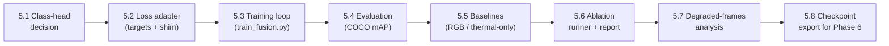

# Phase 5 — Detection Integration & Training (TRC Ablation)

> Status: ✅ **Implemented** — code complete and smoke-verified end to end
> (loss adapter self-test, one-batch loss + freeze contract on a real val batch,
> an overfit training run, and all four ablation variants built, stepped,
> evaluated and tabulated). The long training runs themselves are the user's to
> launch: see §10 and the measured findings in §14.
> Prereq: ✅ Phase 2 (data) + ✅ Phase 3 (preprocessing & TRC) + ✅ Phase 4
> (TRC-gated fusion detector) — see [`PHASE4_IMPLEMENTATION.md`](PHASE4_IMPLEMENTATION.md)
> and [`PHASE4_EXPLAINED.md`](PHASE4_EXPLAINED.md).
> This is **Layer 4** of the 7-layer TriNetra architecture. It turns the
> Phase-4 `FusionDetector` *module* into a **trained, evaluated detector** and
> produces the evidence for the thesis claim: **TRC-gated fusion beats
> non-adaptive fusion**.

Phase 4 delivered a working architecture; Phase 5 makes it *learn* and *proves
it works*. Three deliverables:

1. **Loss wiring** — connect ultralytics' `v8DetectionLoss` to the
   `FusionDetector` output and the Phase-2 dataloader targets.
2. **Two-stage training loop** — Stage 1 (freeze pretrained, train
   thermal + fusion), optional Stage 2 (low-LR fine-tune), with AMP,
   checkpointing, early stopping, and TensorBoard logging.
3. **Evaluation + the four-way ablation** — COCO mAP on the LLVIP test set for
   RGB-only / thermal-only / fusion-no-TRC / **fusion-with-TRC**, plus a
   degraded-frames sub-analysis where TRC should matter most.

> [!IMPORTANT]
> **The headline decision — reuse ultralytics' loss, don't reimplement it.**
> On ultralytics **8.4.89** (verified in this env), the `Detect` head in train
> mode returns a dict `{boxes, scores, feats}` and `v8DetectionLoss.loss()`
> consumes **exactly that dict**. So the Phase-4 forward output plugs straight
> into the stock loss — we only need (a) a small **target-format adapter**
> (our COCO-pixel `[x,y,w,h]` boxes → ultralytics' normalized-xywh batch dict)
> and (b) a tiny **model shim** so the loss can read `model.args` /
> `model.model[-1]`. No custom loss math. See §3.

---

## 1. Overview of Sub-Tasks



| # | Sub-Task | File(s) | Blocking? |
|---|----------|---------|-----------|
| 5.1 | Class-head decision (80-class COCO vs LLVIP classes) | `models/detector/fusion_detector.py` | Yes — decides what "frozen head" means |
| 5.2 | Loss adapter: targets → ultralytics batch dict + model shim | `training/loss_adapter.py` **[NEW]** | Yes |
| 5.3 | Two-stage training loop | `training/train_fusion.py` **[REWRITE]** | Yes — the core |
| 5.4 | COCO-metric evaluation (mAP@0.5, mAP@0.5:0.95) | `training/evaluate.py` **[NEW]** | Yes |
| 5.5 | Single-modality baselines (RGB-only, thermal-only) | `training/baselines.py` **[NEW]** | Yes — for the ablation |
| 5.6 | Ablation runner + results table | `training/run_ablation.py` **[NEW]** | Yes — the claim |
| 5.7 | Degraded-frame analysis (mAP binned by TRC) | inside `training/evaluate.py` | Recommended |
| 5.8 | Config updates + checkpoint export | `configs/default.yaml` | Yes |

---

## 2. The Class-Head Question (READ FIRST — 5.1)

The pretrained `Detect` head predicts **80 COCO classes**. LLVIP labels only
**person** (unified id 1). Three options:

| Option | What changes | Pros | Cons |
|--------|-------------|------|------|
| **A. Keep the 80-class head frozen, map `person`→COCO class 0** ✅ | nothing in the model; targets use COCO index 0 (`person`) | Stage 1 stays truly zero-head-training; COCO person prior is *exactly* our class; strongest transfer | other 79 logits are dead weight (harmless) |
| B. Replace `Detect` with a fresh 1-class head | new random head must be trained | clean class space | throws away the pretrained head — contradicts the Phase-4 freeze strategy |
| C. Keep 80-class head but fine-tune cls branch | partial retraining | adapts scores | more moving parts; muddies the ablation |

**Recommendation: A.** LLVIP `person` (unified id 1) maps to COCO class index
**0** (`person`) — the single most heavily trained class in COCO. The frozen
head already knows how to detect people; Stage 1 only has to teach the fusion
to *feed* it. Evaluation simply ignores the other 79 classes (filter
predictions to class 0). A `class_id_map: {1: 0}` entry in the config makes
this explicit. When multi-class sources (KAIST/M3FD: car, bus, …) are added
later, they also have COCO equivalents — the map extends naturally.

---

## 3. Loss Wiring (5.2) — `training/loss_adapter.py` **[NEW]**

### 3.1 What `v8DetectionLoss` expects (verified on 8.4.89)

```python
loss_fn = v8DetectionLoss(model)     # reads: model.args (hyp), model.model[-1] (Detect),
                                     #        model.parameters() (device), model.class_weights?
loss, loss_items = loss_fn(preds, batch)
#   preds: dict {boxes:[B,64,N], scores:[B,nc,N], feats:[(B,C,h,w)×3]}  ← FusionDetector
#          train-mode output, as-is — verified identical format
#   batch: dict {batch_idx:[M], cls:[M], bboxes:[M,4] normalized xywh}
#   loss:  [3] tensor (box, cls, dfl) × batch_size;  loss_items: detached copy
```

Two adapters are needed:

### 3.2 Target adapter — Phase-2 targets → ultralytics batch dict

```python
def targets_to_batch(targets: list[dict], img_hw: tuple[int, int],
                     class_id_map: dict[int, int]) -> dict:
    """Convert the dataloader's per-sample target dicts into the flat
    batch dict v8DetectionLoss expects.

    Per sample i, for each of its N_i boxes:
      batch_idx ← i                                   (which image in the batch)
      cls       ← class_id_map[labels[j]]             (unified id → COCO index)
      bboxes    ← [x,y,w,h] pixel COCO → normalized CENTER-xywh in [0,1]
                  cx=(x+w/2)/W  cy=(y+h/2)/H  w/=W  h/=H
    """
```

> [!WARNING]
> **The two classic bugs to avoid here** (write unit tests for both):
> 1. COCO boxes are **top-left** xywh; ultralytics wants **center** xywh,
>    normalized. Forgetting the corner→center shift silently trains a
>    detector that's off by half a box.
> 2. The Phase-2 transform already resized boxes to the 640×512 frame —
>    normalize by the **tensor** H/W (from `visible.shape`), never by
>    `orig_size`.

### 3.3 Model shim — make `FusionDetector` loss-compatible

`v8DetectionLoss.__init__` reads `model.args` (hyperparameters:
`box=7.5, cls=0.5, dfl=1.5` gains) and `model.model[-1]` (the Detect module).
Rather than subclass ultralytics, add a light shim:

```python
class LossModelShim:
    """Duck-types the 3 attributes v8DetectionLoss reads off a DetectionModel."""
    def __init__(self, detector: FusionDetector, hyp: SimpleNamespace):
        self.args = hyp                     # box/cls/dfl gains from config
        self.model = [None] * 22 + [detector.head]   # [-1] → Detect module
        self._params = detector.parameters
    def parameters(self): return self._params()
```

(Alternative: set these attributes directly on `FusionDetector` in Phase 5 —
either is fine; the shim keeps Phase-4 code untouched.)

### 3.4 Head stride initialization (one-time gotcha)

The pretrained `Detect` head carries its stride tensor `[8,16,32]` from the
checkpoint — verify `detector.head.stride` is populated at load; if a fresh
head were ever used (Option B), ultralytics computes strides via a dummy
forward, which our dual-input model can't do automatically. With Option A
this is a non-issue, but `assert (head.stride == torch.tensor([8,16,32])).all()`
belongs in the training-startup checks.

---

## 4. Two-Stage Training Loop (5.3) — `training/train_fusion.py` **[REWRITE]**

The existing file is a Phase-7 placeholder — replace it with the real loop.

### 4.1 Skeleton

```python
def train(cfg, stage: int = 1, resume: str | None = None):
    model = FusionDetector(cfg).to(device)
    apply_stage(model, cfg, stage)            # Phase-4 freeze schedule
    loss_fn = build_loss(model, cfg)          # §3 adapter

    train_loader, val_loader, _ = create_dataloaders(cfg)   # Phase 2/3
    opt   = AdamW(trainable_params(model), lr=stage_lr(cfg, stage),
                  weight_decay=cfg.training.weight_decay)
    sched = CosineAnnealingLR(opt, T_max=stage_epochs(cfg, stage))
    scaler = torch.amp.GradScaler(enabled=cfg.training.mixed_precision)

    for epoch in range(stage_epochs(cfg, stage)):
        model.train()                         # Phase-4 override keeps frozen BN in eval
        for visible, thermal, targets in train_loader:
            trc   = FusionDetector.trc_from_targets(targets, device)
            batch = targets_to_batch(targets, visible.shape[-2:], class_map)
            with torch.amp.autocast(enabled=amp):
                preds = model(visible.to(device), thermal.to(device), trc)
                loss, items = loss_fn(preds, batch)     # (box, cls, dfl)
            scaler.scale(loss.sum()).backward()
            scaler.unscale_(opt); clip_grad_norm_(trainable, 10.0)
            scaler.step(opt); scaler.update(); opt.zero_grad(set_to_none=True)
        sched.step()
        metrics = evaluate(model, val_loader, cfg)      # §5
        save_checkpoint(...); early_stop.update(metrics["mAP50"])
```

### 4.2 Per-stage settings (from `fusion.train_schedule`, already in config)

| | Stage 1 | Stage 2 (optional) |
|---|---|---|
| Trainable | thermal backbone + stem, fusion blocks (+α) | + neck, head |
| Frozen | visible backbone, neck, head | visible backbone |
| LR | `training.learning_rate` (1e-3) | `stage2_lr` (1e-4) with 3-epoch linear warmup |
| Epochs | `stage1_epochs` (20) | until early-stop (patience 15) |
| Entry condition | always | only if Stage-1 val mAP plateaus with headroom (see Phase-4 doc §7 Q4) |

Optimizer is **rebuilt** at the Stage 1→2 boundary (the trainable set
changed); Stage 2 resumes from the best Stage-1 checkpoint.

### 4.3 Engineering requirements

- **AMP** (`training.mixed_precision: true`) — the frozen backbone runs fine
  in fp16; keep the loss in fp32 (autocast handles this).
- **Only trainable params in the optimizer** — pass
  `filter(lambda p: p.requires_grad, ...)`, don't rely on zero grads.
- **Checkpoints** → `weights/fusion/`: save `{model_state, opt_state, epoch,
  stage, best_map, cfg_snapshot}`; keep `last.pt` + `best.pt`. Update
  `weights.fusion_checkpoint` convention in the config.
- **TensorBoard** → `runs/fusion/<timestamp>/`: per-iteration box/cls/dfl,
  per-epoch val mAP, LR, the **learned α values** of the three fusion blocks
  (interpretability: is the network obeying TRC?), and a few val images with
  drawn predictions at low/high TRC.
- **Determinism**: seed from `datasets.seed` (42); log the seed and the git
  commit into the checkpoint.
- **Startup self-check**: re-run the Phase-4 `check_grad_flow` assertion once
  before epoch 0 (freeze contract holds after loss/optimizer wiring), and
  assert one batch's loss is finite.

---

## 5. Evaluation (5.4) — `training/evaluate.py` **[NEW]**

### 5.1 Decode → COCO metrics

- Run `model.eval()`; forward gives `(decoded [B, 4+nc, N], raw_dict)`.
  Decoded rows: xywh (pixel) + per-class scores.
- Filter to mapped classes (Option A: class 0), apply confidence threshold
  (`detection.confidence_threshold`) and NMS (`torchvision.ops.nms`,
  `detection.iou_threshold`) — or reuse `ultralytics.utils.nms.non_max_suppression`.
- Convert to COCO detection-JSON format `{image_id, category_id, bbox
  [x,y,w,h], score}` **in the resized frame**, then scale boxes back to
  `orig_size` (targets carry it) so they match the ground-truth JSON.
- Score with **pycocotools** `COCOeval` (already a project dependency) against
  `datasets/annotations/test.json` → **mAP@0.5** and **mAP@0.5:0.95**
  (plus small/medium/large breakdown for free).

### 5.2 Degraded-frame analysis (5.7 — where TRC earns its keep)

The Phase-3 TRC score is already computed per frame at load time. Bin the test
set by TRC and report per-bin mAP:

```
bins: trc < 0.5 (degraded) · 0.5–0.7 (marginal) · ≥ 0.7 (clean)
```

Additionally, run the **stress-test protocol** from Phase 3
(`utils/visualize_preproc.py --stress`): inject blur/saturation into test
thermal frames → TRC drops → compare fusion-with-TRC vs fusion-no-TRC mAP on
the *corrupted* set. This is the controlled experiment where the adaptive gate
must show the largest margin — on clean LLVIP night frames (TRC mean ≈ 0.74)
the two may be near-identical, and §8 of the Phase-4 doc predicts exactly that.

---

## 6. Baselines (5.5) — `training/baselines.py` **[NEW]**

Both baselines reuse the same loop/eval code with a thin model wrapper so the
comparison is apples-to-apples (same data, same schedule, same budget):

| Baseline | Construction | What is trained |
|----------|-------------|-----------------|
| **RGB-only YOLO** | stock `yolov8m.pt` fine-tuned on LLVIP visible | full model, or head-only — mirror Stage-1 budget |
| **Thermal-only YOLO** | `yolov8m.pt` + the Phase-4 `ThermalStem` (mean3ch), single stream | stem + backbone (same warm start as the fusion's thermal branch) |

Implementation note: both are degenerate configurations of the existing code —
RGB-only is `FusionDetector` with the thermal branch ablated
(`fused = P_vis`, achievable via `trc ≡ 0` **at eval** but for a fair
*trained* baseline prefer a plain ultralytics fine-tune), and thermal-only is
the `DualBackbone` thermal stream + stock neck/head. Prefer the simplest
honest implementation over code reuse cleverness — reviewers will ask exactly
how each baseline was trained.

---

## 7. The Ablation (5.6) — `training/run_ablation.py` **[NEW]**

The experiment that earns the thesis claim. Four runs, identical
data/schedule/seed:

| # | Variant | Config delta | Isolates |
|---|---------|--------------|----------|
| 1 | RGB-only | baseline | visible floor |
| 2 | Thermal-only | baseline | thermal floor |
| 3 | Fusion **without** TRC | `fusion.trc_gate.enabled: false` (gate ≡ 1) | does fusion help at all? |
| 4 | Fusion **with** TRC | default config | **does adaptivity help?** |

Output: a markdown table written to `runs/ablation/results.md`:

```
| Variant          | mAP@0.5 | mAP@0.5:0.95 | mAP (trc<0.5) | mAP (stress) |
|------------------|---------|--------------|----------------|--------------|
| RGB-only         |         |              |                |              |
| Thermal-only     |         |              |                |              |
| Fusion (no TRC)  |         |              |                |              |
| Fusion (TRC)     |         |              |                |              |
```

**Success criterion:** row 4 ≥ row 3 overall, and row 4 **>** row 3 by a
clear margin in the `trc<0.5` and stress columns. Also report the learned α
values — α staying near 1.0 is itself evidence the network finds TRC useful.

> [!NOTE]
> Expectation management (from Phase-4 §8): LLVIP is a *night* dataset where
> thermal is usually reliable — on the clean test set rows 3 and 4 may tie
> within noise. The novelty case is made on the degraded/stress columns.
> Report both honestly.

---

## 8. Config Updates (5.8) — `configs/default.yaml`

```diff
 detection:
   model: "yolov8m"
-  input_size: [640, 640]
+  input_size: [640, 512]           # match datasets.image_size (W,H)
   confidence_threshold: 0.25
   iou_threshold: 0.45
-  num_classes: 6
+  num_classes: 6                   # unified ids (head stays 80-class COCO)
+  class_id_map: {1: 0}             # unified person -> COCO class 0 (Option A, §2)

 training:
   batch_size: 16
   num_workers: 4
   epochs: 100
   learning_rate: 0.001
   optimizer: "adamw"
+  weight_decay: 0.0005
+  grad_clip_norm: 10.0
+  loss_gains: {box: 7.5, cls: 0.5, dfl: 1.5}   # ultralytics defaults
+  warmup_epochs: 3
   scheduler: "cosine"
   early_stopping_patience: 15
   mixed_precision: true
   log_dir: "runs/"
+  checkpoint_dir: "weights/fusion/"

 weights:
-  fusion_checkpoint: null
+  fusion_checkpoint: "weights/fusion/best.pt"   # once trained
```

---

## 9. Proposed Changes — File Summary

| Status | File | Purpose |
|--------|------|---------|
| [NEW] | `training/loss_adapter.py` | targets→batch-dict converter + loss model shim (§3) |
| [REWRITE] | `training/train_fusion.py` | two-stage training loop with AMP/ckpt/TB (§4) |
| [NEW] | `training/evaluate.py` | decode + NMS + COCOeval mAP; TRC-binned analysis (§5) |
| [NEW] | `training/baselines.py` | RGB-only & thermal-only baseline training (§6) |
| [NEW] | `training/run_ablation.py` | four-variant runner + results table (§7) |
| [MODIFY] | `configs/default.yaml` | detection/training keys (§8) |
| [MODIFY] | `training/__init__.py` | update docstring/exports |
| [MODIFY] | `utils/check_fusion.py` | add a `--test loss` smoke check (one batch → finite loss, grads flow) |

---

## 10. Verification Plan

```bash
# 1. Loss adapter unit checks (corner→center, normalization, class map)
python -m training.loss_adapter --self-test

# 2. One-batch smoke: finite loss + Stage-1 grad contract still holds
python utils/check_fusion.py --test loss --split val

# 3. Overfit sanity: train on 32 images for ~50 epochs -> loss ≈ 0, mAP ≈ 1 on them
python training/train_fusion.py --overfit 32

# 4. Short real run: 2 epochs Stage 1 -> val mAP must beat epoch-0 (frozen-random fusion)
python training/train_fusion.py --stage 1 --epochs 2

# 5. Full Stage 1, then evaluate on test
python training/train_fusion.py --stage 1
python training/evaluate.py --checkpoint weights/fusion/best.pt --split test

# 6. The ablation
python training/run_ablation.py
```

**Manual:** epoch-0 val mAP should already be *non-trivial* (the near-identity
fusion init means the model starts as ~an RGB YOLO with a COCO person head —
a strong sanity anchor); TensorBoard α curves should stay in a sane range
(~0.5–2); the frozen-param count printed at startup must match Phase 4's
25,902,640.

---

## 11. Open Questions

> [!IMPORTANT]
> **1. Class head — Option A (frozen 80-class, map person→0)?**
> §2 recommends A. Decide before writing the adapter; B/C change the freeze
> schedule and weaken the "frozen pretrained head" story.

> [!IMPORTANT]
> **2. Baseline training budget — head-only or full fine-tune?**
> The fairest comparison matches *trainable parameter budget* to the fusion
> run (≈17M). Recommendation: give every variant the same schedule (epochs,
> LR, early stopping) and report trainable-param counts per variant in the
> results table.

> [!IMPORTANT]
> **3. Is Stage 2 in scope for Phase 5?**
> Recommendation: implement the mechanism (it's ~10 lines given Phase-4's
> `apply_stage`) but only *run* it if the Stage-1 ablation shows headroom.

> [!IMPORTANT]
> **4. Augmentation for training — enable mosaic?**
> `datasets.augmentation.mosaic` is off. Mosaic complicates the TRC story
> (four frames, four TRC scores → which gates the composite?). Recommendation:
> keep mosaic **off** for Phase 5 so the TRC semantics stay clean; note it as
> future work.

---

## 12. Success Criteria & Hand-Off to Phase 6

Phase 5 is done when:

1. `train_fusion.py` completes Stage 1 with monotonically improving val mAP
   and a saved `weights/fusion/best.pt`;
2. `evaluate.py` reports test mAP@0.5 / mAP@0.5:0.95 via COCOeval;
3. the **four-way ablation table exists** with honest numbers, including the
   TRC-binned and stress-test columns;
4. the freeze contract held throughout (startup grad-flow check passes at
   every stage).

Phase 6 (tracking, Layer 5) consumes `weights/fusion/best.pt` through the
`FusionDetector` eval path — per-frame decoded detections feed DeepSORT /
ByteTrack as configured in the `tracking` block.

---

## 13. Quick Viva Cheat-Sheet

- **What is Phase 5?** Training + evaluation of the Phase-4 fusion detector,
  and the ablation that proves the TRC novelty.
- **What loss?** Ultralytics' own `v8DetectionLoss` (box CIoU + BCE cls + DFL)
  — our head's train-mode output dict is bit-compatible with it; only the
  *targets* needed an adapter (COCO corner-xywh pixels → normalized center-xywh).
- **What classes?** The frozen 80-class COCO head; LLVIP `person` maps to COCO
  class 0. No head surgery.
- **Two stages?** Stage 1 trains thermal+fusion (17M params) against the frozen
  detector; Stage 2 optionally fine-tunes neck+head at LR 1e-4.
- **How is "better" proven?** Four-way ablation on the LLVIP test set; the
  claim rests on fusion-with-TRC vs fusion-without-TRC, especially on
  low-TRC / stress-corrupted frames.
- **What if clean-set gains are small?** Expected — LLVIP night frames have
  high TRC. The adaptive gate is insurance for degraded thermal; that's what
  the binned/stress columns measure.

---

## 14. Implementation Findings (measured while wiring Phase 5 up)

Four things only showed up once the loss and the evaluator were actually run
against real data. All four are fixed in the code; they are recorded here
because each one changes a claim the plan above makes.

### 14.1 Input normalization silently destroyed the pretrained prior 🔴

`configs/default.yaml` normalized the visible stream with **ImageNet** stats
(`mean 0.485/0.456/0.406`, `std 0.229/0.224/0.225`). Ultralytics YOLOv8 is
trained on **plain 0–1 pixels**, so the frozen COCO backbone was being fed
inputs roughly two standard deviations off distribution. Measured on one val
batch with the stock `yolov8m.pt`:

| Visible input | person detections (8 images) |
|---------------|------------------------------|
| ImageNet-standardized | `0 0 0 0 0 0 0 0` |
| plain 0–1             | `4 3 0 3 5 5 4 1` |

Untrained-fusion val mAP@0.5 over 64 images went **0.000 → 0.768** once the
stats were changed to identity (`mean 0`, `std 1` — i.e. a plain `/255`). This
is exactly the "strong sanity anchor" §10 predicts, and it was unreachable
before. The thermal branch got the same treatment (`mean 0`, `std 1`) because
`ThermalStem`'s `mean3ch` warm start inherits kernels that expect that range.

**Consequence:** with the old stats, Stage 1 would have had to relearn
detection from scratch through the fusion blocks alone — the frozen backbone
can never adapt. `utils/visualize.py` reads the same config keys to
de-normalize, so it stays correct automatically.

### 14.2 `SingleModalDetector` trained nothing (RGB baseline) 🔴

`YOLO(path).model` hands back a checkpoint whose parameters all have
`requires_grad=False` — ultralytics re-enables them inside its own trainer,
which we bypass. `FusionDetector` never hit this because `apply_stage(1)`
unfreezes everything before freezing the pretrained parts. The RGB baseline,
whose default freeze set is empty, reported **0 trainable parameters** and
`backward()` raised `element 0 of tensors does not require grad`. Fixed by
explicitly enabling grads before applying the freeze set.

### 14.3 The thermal baseline crashed on the stock forward pass 🔴

`DetectionModel.forward` walks layers by their `f`/`i` from-index attributes;
the Phase-4 `DualBackbone` walks them by list index instead, so `ThermalStem`
never needed them. Dropping the stem into `det.model[0]` for the thermal-only
baseline raised `'ThermalStem' object has no attribute 'f'`. Fixed in
`training/baselines.py` by copying `i`/`f`/`type`/`np` onto the replacement —
Phase-4 code stays untouched.

### 14.4 The `trc < 0.5` column is empty on clean LLVIP ⚠️

Measured TRC over 400 clean test frames: **mean 0.744, min 0.726, max 0.766**
— every frame lands in the "clean" bin. §5.2's degraded bin is not merely
sparse on LLVIP, it is *empty*, so the clean-set degraded column can never
carry the claim.

The stress protocol does reach it. Through the full preprocessing pipeline:

| Injected corruption | TRC (clean → stressed) |
|---------------------|------------------------|
| `blur`     | 0.744 → 0.676 (marginal bin) |
| `saturate` | 0.745 → 0.398 (**degraded bin**) |

With the 50/50 blur/saturate split, ~half the stress set falls below 0.5
(measured: 31 of 64). **The degraded evidence for the thesis claim therefore
lives entirely in the stress block**, and `runs/ablation/results.md` now prints
the TRC-binned mAP for the stress set as well as the clean one, with a note
saying why the clean column is blank rather than leaving an unexplained dash.

### 14.5 Two Windows-specific correctness traps (fixed)

* The stress hook was a **closure** assigned onto the dataset. `create_dataloaders`
  uses `num_workers: 4`, and Windows spawns workers by pickling the dataset —
  `Can't pickle local object`. It is now a module-level `StressThermalLoader`.
* `create_dataloaders` also sets `persistent_workers=True`, so workers hold a
  copy of the dataset made when iteration *first* started. Patching a loader
  that has already been iterated is a silent no-op (observed: an identical TRC
  distribution before and after "installing" the corruption).
  `install_stress_corruption` now accepts the loader and clears its cached
  iterator, and the ablation scores the stress set through a fresh loader.

### 14.6 Verified, and not

Verified by running:

1. `python -m training.loss_adapter --self-test` — all five unit checks.
2. `python utils/check_fusion.py --test loss --split val` — finite loss on a
   real batch and the freeze contract intact *after* loss wiring, at
   **17,019,411 trainable / 25,902,640 frozen** (matches Phase 4 exactly).
3. `python training/train_fusion.py --overfit 16 --epochs 4` — the full `fit()`
   loop end to end: startup checks, AMP step, cosine LR, per-epoch COCOeval,
   `best.pt`/`last.pt` checkpointing.
4. `python training/evaluate.py --checkpoint … --split val` — the whole 2122-image
   val split through decode → NMS → COCOeval → TRC bins.
5. All four ablation variants built, stepped, scored on clean + stress, and
   rendered into the results table.

`--test loss` also had to be wired into `check_fusion.py`'s CLI: the function
existed but no `--test` choice reached it, so the §10.2 check could not run.

Not run: the full Stage-1 schedule, Stage 2, and the real ablation. Those are
GPU-hours, not code. Every number quoted above comes from *untrained* models
and is a starting anchor, not a result.
