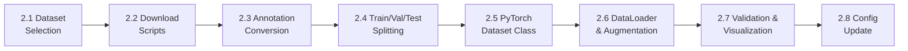

# Phase 2 — Data Acquisition & Dataset Preparation

Phase 1 (scaffold) is complete. Phase 2 builds the entire data pipeline — from downloading raw datasets to having a working PyTorch `DataLoader` that yields aligned visible+thermal image pairs with COCO-format annotations.

---

## Overview of Sub-Tasks



| # | Sub-Task | New Files | Phase-Blocking? |
|---|----------|-----------|-----------------|
| 2.1 | Dataset selection & download | `datasets/download.py` | Yes — everything depends on data |
| 2.2 | Directory organization | — (handled by download script) | — |
| 2.3 | Annotation conversion to COCO | `datasets/convert_annotations.py` | Yes — DataLoader needs COCO JSON |
| 2.4 | Train/Val/Test splitting | `datasets/split_dataset.py` | Yes — training needs splits |
| 2.5 | PyTorch Dataset class | `datasets/dual_modal_dataset.py` | Yes — core data pipeline |
| 2.6 | DataLoader + augmentation | `datasets/augmentations.py`, `datasets/dataloader.py` | Yes — training batch pipeline |
| 2.7 | Data validation & visualization | `utils/visualize.py`, `utils/data_stats.py` | No — but highly recommended |
| 2.8 | Config updates | modify `configs/default.yaml` | Yes — all scripts read config |

---

## 2.1 — Dataset Selection

> [!IMPORTANT]
> **Which dataset(s) do you want to use?** This choice affects annotation conversion, class definitions, and storage requirements. You can start with one and add more later.

### Recommended Datasets (Ranked for Surveillance)

| Dataset | Pairs | Size | Classes | Format | Day/Night | Best For |
|---------|-------|------|---------|--------|-----------|----------|
| **LLVIP** ⭐ | 15,488 | ~4 GB | Pedestrian | VOC XML | Night-heavy | Nighttime surveillance, easiest to start |
| **KAIST** | 95,328 | ~36 GB | Person, Cyclist | Custom TXT | Both | Gold standard, largest scale |
| **M3FD** | 4,200 | ~3 GB | 6 (Person, Car, Bus, Motorcycle, Lamp, Truck) | VOC XML | Both | Multi-class, compact |
| **FLIR ADAS v2** | 9,711 | ~20 GB | 15 categories | **COCO JSON** ✅ | Both | Already COCO format, broadest classes |
| **DroneVehicle** | 28,439 | ~13 GB | 5 vehicles | OBB custom | Both | Aerial/drone surveillance |

> [!TIP]
> **My recommendation**: Start with **LLVIP** (small, clean, perfectly aligned, fast iteration) and **M3FD** (multi-class diversity). Add KAIST later for scale. FLIR ADAS is great but requires spatial alignment.

### Download Sources

| Dataset | URL |
|---------|-----|
| LLVIP | https://bupt-ai-cz.github.io/LLVIP/ (registration required) |
| KAIST | https://soonminhwang.github.io/rgbt-ped-detection/ |
| M3FD | https://github.com/JinyuanLiu-CV/TarDAL (Google Drive links) |
| FLIR ADAS v2 | https://www.flir.com/oem/adas/adas-dataset-agree/ |
| DroneVehicle | https://github.com/VisDrone/DroneVehicle |

---

## 2.2 — Directory Organization

After download, data should be organized into this canonical structure:

```
datasets/
├── visible/
│   ├── train/
│   │   ├── 000001.jpg
│   │   ├── 000002.jpg
│   │   └── ...
│   ├── val/
│   └── test/
├── thermal/
│   ├── train/
│   │   ├── 000001.jpg    ← same filename = same scene pair
│   │   ├── 000002.jpg
│   │   └── ...
│   ├── val/
│   └── test/
├── annotations/
│   ├── train.json         ← COCO format
│   ├── val.json
│   └── test.json
├── calibration/
│   └── homography.npy     ← 3×3 alignment matrix (if needed)
├── download.py
├── convert_annotations.py
├── split_dataset.py
├── dual_modal_dataset.py
├── augmentations.py
├── dataloader.py
└── __init__.py
```

> [!IMPORTANT]
> **Pairing convention**: Visible and thermal images are paired by **identical filenames**. `visible/train/000001.jpg` pairs with `thermal/train/000001.jpg`.

---

## 2.3 — Annotation Conversion to COCO Format

### [NEW] `datasets/convert_annotations.py`

All datasets must be converted to a **unified COCO JSON format**. This script handles:

| Source Dataset | Source Format | Conversion Needed |
|---|---|---|
| LLVIP | Pascal VOC XML | XML → COCO JSON |
| KAIST | Custom TXT (Caltech-style) | TXT → COCO JSON |
| M3FD | Pascal VOC XML | XML → COCO JSON |
| FLIR ADAS v2 | COCO JSON ✅ | No conversion (just copy/validate) |

### Target COCO JSON Structure

```json
{
  "info": {
    "description": "TriNetra Dual-Modality Dataset",
    "version": "1.0",
    "year": 2026
  },
  "categories": [
    {"id": 1, "name": "person", "supercategory": "human"},
    {"id": 2, "name": "car", "supercategory": "vehicle"},
    {"id": 3, "name": "bus", "supercategory": "vehicle"},
    {"id": 4, "name": "truck", "supercategory": "vehicle"},
    {"id": 5, "name": "motorcycle", "supercategory": "vehicle"},
    {"id": 6, "name": "cyclist", "supercategory": "human"}
  ],
  "images": [
    {
      "id": 1,
      "file_name": "000001.jpg",
      "width": 640, "height": 512
    }
  ],
  "annotations": [
    {
      "id": 101,
      "image_id": 1,
      "category_id": 1,
      "bbox": [x, y, width, height],
      "area": 4000.0,
      "iscrowd": 0
    }
  ]
}
```

**Key details:**
- `bbox` = `[x_top_left, y_top_left, width, height]` in absolute pixels
- `area` = `width × height`
- All IDs are unique integers (1-indexed)
- `file_name` is the **shared filename** (same for both visible and thermal)

### What the script will do:

```python
def convert_voc_to_coco(voc_dir, image_dir, output_json, category_map):
    """
    Convert Pascal VOC XML annotations to COCO JSON.
    
    1. Walk voc_dir for all .xml files
    2. Parse each XML: extract filename, size, objects (name, bndbox)
    3. Map class names to unified category IDs via category_map
    4. Build COCO dict with images[], categories[], annotations[]
    5. Write output JSON
    """

def convert_kaist_to_coco(kaist_annot_dir, output_json, category_map):
    """
    Convert KAIST custom TXT annotations to COCO JSON.
    
    1. Parse each .txt file (format: class x y w h)
    2. Map to COCO structure
    """

def validate_coco_json(json_path):
    """
    Validate COCO JSON for correctness:
    - All image_ids in annotations exist in images
    - All category_ids exist in categories
    - No duplicate IDs
    - All bboxes have positive width/height
    """
```

---

## 2.4 — Train/Val/Test Splitting

### [NEW] `datasets/split_dataset.py`

Splits the paired dataset into train/val/test while ensuring:
- **Matched splitting** — the same image pair goes to the same split (visible & thermal stay together)
- **Stratified** — class distribution is preserved across splits
- **Deterministic** — fixed random seed for reproducibility

```python
def split_dataset(
    annotations_json: str,
    visible_dir: str,
    thermal_dir: str,
    output_dir: str,
    ratios: dict = {"train": 0.7, "val": 0.15, "test": 0.15},
    seed: int = 42
):
    """
    1. Load COCO annotations JSON
    2. Shuffle image IDs with fixed seed
    3. Split into train/val/test by ratio
    4. Copy/symlink visible images to visible/{split}/
    5. Copy/symlink thermal images to thermal/{split}/
    6. Create separate COCO JSONs: train.json, val.json, test.json
    7. Print split statistics (images per split, objects per class per split)
    """
```

**Config-driven** — reads `split_ratios` from [default.yaml](file:///c:/Users/khati/Downloads/Tri-Netra/configs/default.yaml#L21-L24).

---

## 2.5 — PyTorch Dual-Modality Dataset

### [NEW] `datasets/dual_modal_dataset.py`

The core data class — loads paired visible+thermal images with COCO annotations.

```python
class DualModalDataset(torch.utils.data.Dataset):
    """
    PyTorch Dataset for paired visible + thermal imagery.
    
    Returns per __getitem__:
        visible_img:  Tensor [3, H, W]  — RGB image
        thermal_img:  Tensor [1, H, W]  — Single-channel thermal
        targets:      dict with keys:
            - boxes:    Tensor [N, 4]   — COCO format [x, y, w, h]
            - labels:   Tensor [N]      — Category IDs
            - image_id: int
    """
    
    def __init__(self, 
                 visible_dir: str,
                 thermal_dir: str,
                 annotations_json: str,
                 transforms=None,
                 thermal_transforms=None):
        # 1. Load COCO JSON with pycocotools
        # 2. Build image_id → filename mapping
        # 3. Verify all pairs exist (visible + thermal)
    
    def __getitem__(self, idx):
        # 1. Load visible image (PIL → RGB)
        # 2. Load thermal image (PIL → grayscale)
        # 3. Load annotations for this image_id
        # 4. Apply synchronized transforms (same spatial transform to both)
        # 5. Return (visible_tensor, thermal_tensor, targets)
    
    def __len__(self):
        return len(self.image_ids)
```

> [!IMPORTANT]
> **Synchronized augmentation** is critical — if you flip or crop the visible image, the thermal image must receive the exact same spatial transform. Otherwise the pixel-level correspondence breaks.

---

## 2.6 — Augmentations & DataLoader

### [NEW] `datasets/augmentations.py`

Dual-modality-aware augmentations using **Albumentations**:

```python
def get_train_transforms(input_size=(640, 640)):
    """
    Spatial transforms (applied identically to both modalities):
        - RandomResizedCrop
        - HorizontalFlip
        - RandomRotate90
        
    Visible-only transforms (color/intensity — NOT applied to thermal):
        - ColorJitter (brightness, contrast, saturation)
        - RandomGamma
        
    Thermal-only transforms:
        - GaussianNoise (simulates sensor noise)
        - RandomBrightnessContrast (mild)
    """

def get_val_transforms(input_size=(640, 640)):
    """Deterministic resize + normalize only."""
```

### [NEW] `datasets/dataloader.py`

Factory function for creating DataLoaders:

```python
def create_dataloaders(config: dict) -> tuple:
    """
    Returns (train_loader, val_loader, test_loader).
    
    - Reads paths from config
    - Creates DualModalDataset instances
    - Wraps in DataLoader with custom collate_fn
    - Configures num_workers, pin_memory, prefetch
    """

def dual_modal_collate_fn(batch):
    """
    Custom collate for variable-length annotations.
    Stacks visible and thermal tensors, keeps targets as list of dicts.
    """
```

---

## 2.7 — Validation & Visualization Tools

### [NEW] `utils/data_stats.py`

```python
def compute_dataset_statistics(annotations_json: str):
    """
    Print/return:
    - Total images, total annotations
    - Class distribution (histogram)
    - Bbox size distribution (small/medium/large per COCO definition)
    - Images with no annotations (negatives)
    - Aspect ratio distribution
    """
```

### [NEW] `utils/visualize.py`

```python
def visualize_pair(visible_path, thermal_path, annotations, output_path=None):
    """
    Side-by-side visualization:
    [Visible with bboxes] | [Thermal with bboxes] | [Overlay/blend]
    
    Color-coded by class. Saves to file or displays with matplotlib.
    """

def visualize_batch(dataloader, num_samples=8, output_path=None):
    """
    Grid visualization of a batch from the DataLoader.
    Confirms that transforms are applied correctly.
    """
```

---

## 2.8 — Config Updates

### [MODIFY] [default.yaml](file:///c:/Users/khati/Downloads/Tri-Netra/configs/default.yaml)

Add dataset-specific configuration:

```diff
 datasets:
   visible_dir: "datasets/visible/"
   thermal_dir: "datasets/thermal/"
   annotations_dir: "datasets/annotations/"
   calibration_dir: "datasets/calibration/"
+  # Active dataset source (llvip, kaist, m3fd, flir_adas)
+  active_source: "llvip"
+  # Unified category mapping
+  categories:
+    - {id: 1, name: "person", supercategory: "human"}
+    - {id: 2, name: "car", supercategory: "vehicle"}
+    - {id: 3, name: "bus", supercategory: "vehicle"}
+    - {id: 4, name: "truck", supercategory: "vehicle"}
+    - {id: 5, name: "motorcycle", supercategory: "vehicle"}
+    - {id: 6, name: "cyclist", supercategory: "human"}
+  # Image properties
+  image_size: [640, 512]
+  # Augmentation settings
+  augmentation:
+    horizontal_flip_prob: 0.5
+    rotation_limit: 15
+    color_jitter: true
+    mosaic: false           # Enable in later phases
   split_ratios:
     train: 0.7
     val: 0.15
     test: 0.15
```

---

## Proposed Changes — File Summary

### Data Pipeline

| Status | File | Purpose |
|--------|------|---------|
| [NEW] | `datasets/__init__.py` | Package init |
| [NEW] | `datasets/download.py` | Download & organize raw data |
| [NEW] | `datasets/convert_annotations.py` | VOC/KAIST → COCO JSON conversion |
| [NEW] | `datasets/split_dataset.py` | Train/val/test splitting |
| [NEW] | `datasets/dual_modal_dataset.py` | PyTorch Dataset class |
| [NEW] | `datasets/augmentations.py` | Albumentations transforms |
| [NEW] | `datasets/dataloader.py` | DataLoader factory + collate |

### Utilities

| Status | File | Purpose |
|--------|------|---------|
| [NEW] | `utils/visualize.py` | Paired image visualization |
| [NEW] | `utils/data_stats.py` | Dataset statistics & class distribution |

### Config

| Status | File | Purpose |
|--------|------|---------|
| [MODIFY] | `configs/default.yaml` | Add dataset source, categories, augmentation |

---

## Verification Plan

### Automated Tests
```bash
# 1. Run annotation conversion and validate output
python datasets/convert_annotations.py --source llvip --validate

# 2. Run dataset split and verify ratios
python datasets/split_dataset.py --config configs/default.yaml

# 3. Test DataLoader yields correct shapes
python -c "
from datasets.dataloader import create_dataloaders
import yaml
cfg = yaml.safe_load(open('configs/default.yaml'))
train_dl, val_dl, _ = create_dataloaders(cfg)
batch = next(iter(train_dl))
print(f'Visible: {batch[0].shape}')   # [B, 3, H, W]
print(f'Thermal: {batch[1].shape}')   # [B, 1, H, W]
print(f'Targets: {len(batch[2])} dicts')
"

# 4. Generate visualization samples
python utils/visualize.py --split train --num-samples 8
```

### Manual Verification
- Inspect the generated `train.json` / `val.json` / `test.json` for correctness
- View side-by-side pair visualizations to confirm alignment
- Verify class distribution histograms across splits

---

## Open Questions

> [!IMPORTANT]
> **1. Which dataset(s) should I start with?**
> - **LLVIP only** (~4 GB, fastest to set up, pedestrian-only)
> - **LLVIP + M3FD** (~7 GB, adds multi-class vehicles)
> - **All four** (LLVIP + M3FD + KAIST + FLIR ADAS — ~75 GB)
> - Other combination?

> [!IMPORTANT]
> **2. Do you have any of these datasets already downloaded?**
> If so, tell me the path and I'll write the conversion scripts for that specific format first.

> [!IMPORTANT]
> **3. Should I write actual download automation** (gdown, wget scripts), or just document the manual download steps?
> Some datasets (LLVIP, FLIR ADAS) require registration/agreement before download.
